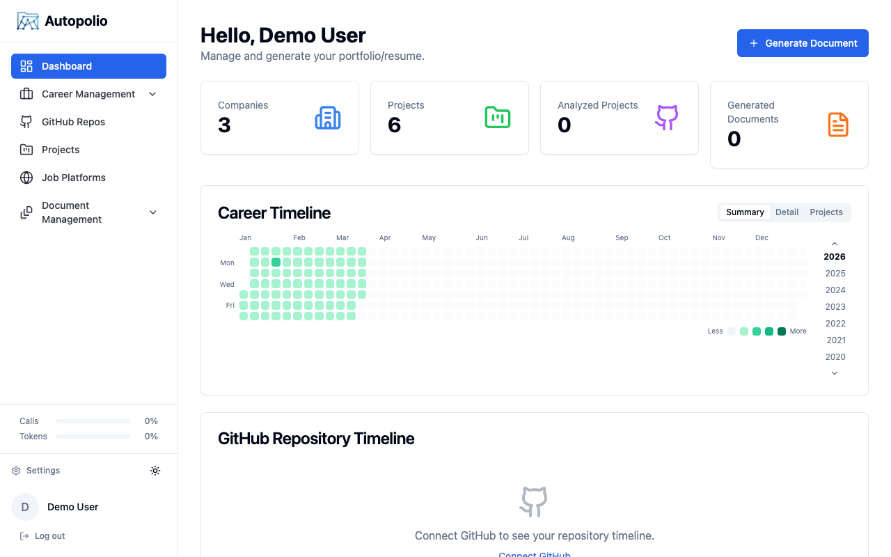
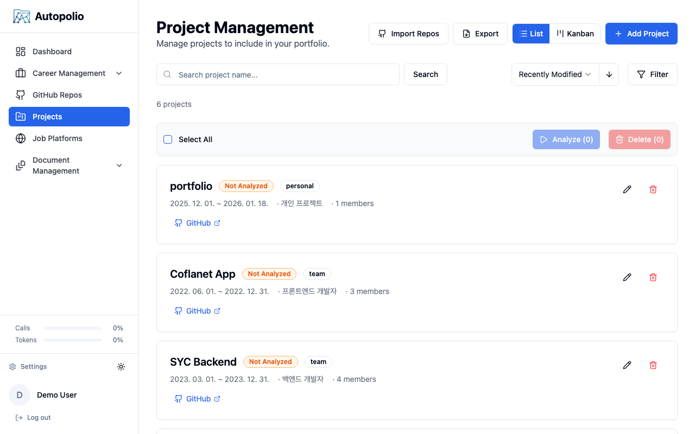
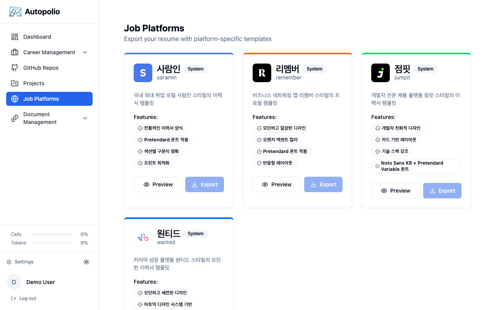
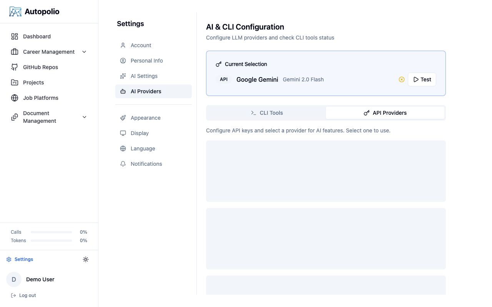

# Autopolio

> Turn your GitHub into a professional portfolio — powered by AI

[](https://opensource.org/licenses/Apache-2.0)
[](https://github.com/sehoon787/Autopolio/actions/workflows/ci.yml)
[](https://github.com/sehoon787/Autopolio/actions/workflows/lint.yml)
[](https://www.python.org/downloads/)
[](https://nodejs.org/)
[](https://github.com/sehoon787/Autopolio)
[](https://github.com/sehoon787/Autopolio/releases)

[🇰🇷 한국어 README](README_ko.md)

**Autopolio** is an open-source, AI-powered portfolio and resume automation platform. It analyzes your GitHub repositories, builds a structured career knowledge base, and generates tailored resumes for major job platforms — all without manually writing every line.

---

## Screenshots

<table>
<tr>
<td><br/><em>Dashboard & Career Timeline</em></td>
<td><br/><em>Project Management</em></td>
</tr>
<tr>
<td><br/><em>Job Platform Templates</em></td>
<td><br/><em>AI Provider Settings</em></td>
</tr>
</table>

Additional screenshots: [Document Generation](docs/screenshots/06-generate.png) · [Template Management](docs/screenshots/08-templates.png) · [GitHub Setup](docs/screenshots/07-github-setup.png)

---

## Why Autopolio

Most developers have rich GitHub histories but blank resume pages. Writing a tailored resume for each job platform (Saramin, Remember, Jumpit) takes hours of repetitive effort. Autopolio closes that gap: connect your GitHub, define your career history once, and let the AI pipeline do the rest.

---

## Key Features

- **GitHub Repository Analysis** — Parses commit history and auto-detects 200+ technologies across JavaScript, Python, Java, Kotlin, Dart, PHP, and more — no LLM required for detection
- **Per-Contributor Breakdown** — Isolates your commits from team repos; Conventional Commit parsing, work area detection, and code quality metrics
- **Career Knowledge Base** — Structured management of companies, projects, achievements, certifications, education, and awards
- **Platform Resume Templates** — Pre-built HTML templates for Saramin, Remember, and Jumpit; Mustache syntax for fully custom templates
- **Multi-LLM AI Summarization** — OpenAI GPT-4, Anthropic Claude, and Google Gemini all supported; switchable per request
- **Multiple Export Formats** — DOCX, PDF, and Markdown output from a single source
- **Electron Desktop App** — Cross-platform installer for Windows (exe), macOS (dmg), and Linux (AppImage) with local CLI tool support
- **Internationalization** — Full UI in Korean and English via react-i18next
- **CI/CD Pipeline** — GitHub Actions with pytest, Playwright, ruff, tsc, Bandit security scanning, and Gemini Code Assist review

---

## How It Works

```
Step 1 — GitHub Analysis       Fetch commits and extract statistics (parallel)
Step 2 — Code Extraction       Detect code patterns and project architecture
Step 3 — Tech Detection        Auto-detect tech stack from dependency files (fast, no LLM)
Step 4 — Achievement Detection Extract quantitative achievements from commit messages
Step 5 — LLM Summarization     Generate AI-powered project summaries (parallel)
Step 6 — Template Mapping      Map structured data to platform-specific template fields
Step 7 — Document Generation   Produce DOCX / PDF / Markdown output
```

---

## Quick Start

### Option A: Docker (recommended)

```bash
git clone https://github.com/sehoon787/Autopolio.git
cd Autopolio

cp .env.example .env
# Edit .env — set ENCRYPTION_KEY, GITHUB_CLIENT_ID/SECRET, and one LLM API key

docker-compose up -d
```

Open `http://localhost:3035` in your browser.

### Option B: Dev script

```bash
git clone https://github.com/sehoon787/Autopolio.git
cd Autopolio
cp .env.example .env

# Windows
start-dev.bat

# Linux / macOS
./start-dev.sh
```

### Option C: Manual

```bash
# Backend
uv sync
uv run uvicorn api.main:app --reload --port 8085

# Frontend (separate terminal)
cd frontend
npm install
npm run dev
```

| Service | URL |
|---------|-----|
| Frontend | http://localhost:3035 |
| API Docs (Swagger) | http://localhost:8085/docs |
| API Docs (ReDoc) | http://localhost:8085/redoc |

> Ports are configured in `config/runtime.yaml`.

---

## Electron Desktop App

```bash
cd frontend

npm run electron:dev            # Development mode

npm run electron:build:win      # Windows exe (NSIS)
npm run electron:build:mac      # macOS dmg
npm run electron:build:linux    # Linux AppImage
```

---

## Testing

```bash
# Full suite: Docker → pytest → Playwright
tests/scripts/run-all.sh          # Linux / macOS
tests/scripts/run-all.bat         # Windows

# API tests only
tests/scripts/run-api-tests.sh

# E2E tests only
tests/scripts/run-e2e-tests.sh
```

### Seed Data

Populate a local environment with realistic sample data:

```bash
python tests/seed_sample_data.py            # Insert sample data
python tests/seed_sample_data.py --clean    # Wipe first, then insert
python tests/seed_sample_data.py --create-user  # Create user + insert
```

Inserts 3 companies, 6 projects, 2 education records, 4 training records, 3 certifications, 2 awards, 3 publications, 2 patents, and 2 activities.

---

## Tech Stack

| Layer | Technologies |
|-------|-------------|
| Backend | FastAPI, SQLAlchemy, SQLite |
| Frontend | React 19, TypeScript, Vite, Tailwind CSS, Shadcn/ui |
| Desktop | Electron, electron-builder, electron-serve |
| State Management | Zustand, TanStack Query |
| Internationalization | react-i18next, i18next |
| LLM | OpenAI GPT-4 / Anthropic Claude / Google Gemini |
| Document Generation | python-docx, reportlab, chevron (Mustache) |
| Package Managers | uv (Python), npm (Frontend) |
| CI/CD | GitHub Actions + Gemini Code Assist |
| Testing | pytest, Playwright |

---

## Project Structure

```
Autopolio/
├── api/                     # FastAPI backend
│   ├── constants/           # Centralized enums and config constants
│   ├── models/              # SQLAlchemy ORM models
│   ├── schemas/             # Pydantic request/response schemas
│   ├── routers/             # API route handlers (modularized)
│   └── services/            # Business logic (modularized)
├── frontend/                # React frontend + Electron
│   ├── electron/            # Electron main process and services
│   └── src/
│       ├── api/             # API client functions
│       ├── components/      # Reusable UI components
│       ├── locales/         # i18n translation files (ko, en)
│       ├── pages/           # Page components
│       └── stores/          # Zustand state stores
├── .github/workflows/       # CI/CD pipeline definitions
├── tests/                   # Test scripts and E2E tests
├── config/                  # YAML configuration files
├── data/                    # SQLite database and platform HTML templates
├── docs/                    # Project documentation and screenshots
├── result/                  # Generated output documents
├── pyproject.toml           # Python dependencies (uv)
└── docker-compose.yml
```

---

## Key API Endpoints

| Method | Path | Description |
|--------|------|-------------|
| `POST` | `/api/users` | Create a user |
| `GET` | `/api/github/repos` | List connected repositories |
| `POST` | `/api/github/analyze` | Start repository analysis |
| `GET` | `/api/github/contributor-analysis/{id}` | Per-user detailed analysis |
| `GET` | `/api/knowledge/projects` | List projects |
| `GET` | `/api/platforms` | List platform resume templates |
| `POST` | `/api/platforms/{id}/render` | Render a template with user data |
| `POST` | `/api/pipeline/run` | Run the full generation pipeline |
| `GET` | `/api/documents` | List generated documents |

Full interactive documentation is at `http://localhost:8085/docs` when the server is running.

---

## Environment Variables

| Variable | Description | Required |
|----------|-------------|----------|
| `ENCRYPTION_KEY` | Fernet encryption key for stored tokens | Yes |
| `LLM_PROVIDER` | Default LLM provider (`openai` / `anthropic` / `gemini`) | Yes |
| `OPENAI_API_KEY` | OpenAI API key | One of the three |
| `ANTHROPIC_API_KEY` | Anthropic API key | One of the three |
| `GEMINI_API_KEY` | Google Gemini API key | One of the three |
| `GITHUB_CLIENT_ID` | GitHub OAuth App client ID | Yes |
| `GITHUB_CLIENT_SECRET` | GitHub OAuth App client secret | Yes |
| `DATABASE_URL` | SQLite database path (default: `data/autopolio.db`) | No |

---

## Contributing

Contributions are welcome. See [CONTRIBUTING.md](CONTRIBUTING.md) for guidelines on reporting bugs, proposing features, and submitting pull requests. The project roadmap is tracked in [docs/ROADMAP.md](docs/ROADMAP.md).

This project follows the [Contributor Covenant Code of Conduct](CODE_OF_CONDUCT.md).

## License

Apache License 2.0 — see the [LICENSE](LICENSE) file for details.
